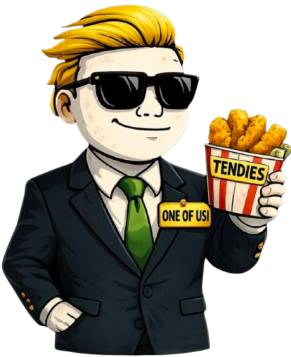
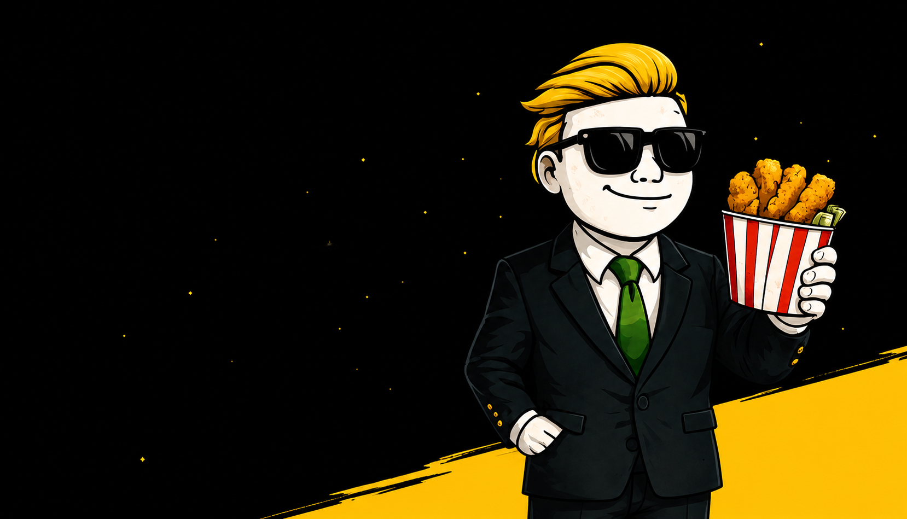
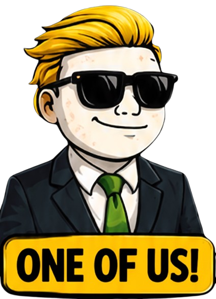
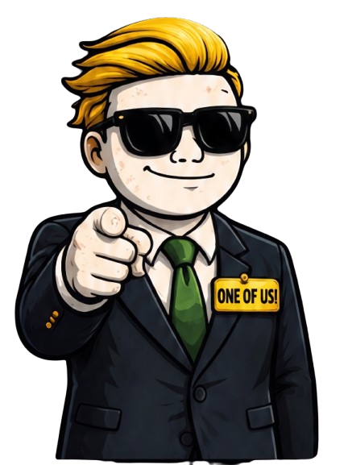

# <p align="center"></p>

<h1 align="center">ONE OF US — $ONE</h1>

<p align="center">
  <strong>NOT JUST A PHRASE. IT'S THE CULTURE.</strong><br>
  High risks. Big laughs. You belong here. Welcome home.
</p>

<p align="center">
  <a href="https://x.com/ONEofUshood" target="_blank">
    
  </a>
  <a href="https://oneofushood.com" target="_blank">
    
  </a>
</p>

---

## 📸 Banner & Social Preview

<p align="center">
  
</p>

---

## 🪙 Token & Culture Information

The **ONE OF US ($ONE)** community is built around the iconic phrase *"One of us! One of us!"* which originated in the classic 1932 film *Freaks*. 

Adopted heavily by modern internet and trading communities (such as Reddit's WallStreetBets), the phrase represents the ultimate badge of honor for anyone who takes big, outrageous risks, laughs at the chaos of the market, and finds belonging in a community of like-minded traders.

### 📊 Token Metrics

| Parameter | Value |
| :--- | :--- |
| **Token Name** | One Of Us |
| **Ticker** | `$ONE` |
| **Official Handle** | [@ONEofUshood](https://x.com/ONEofUshood) |
| **Website** | [oneofushood.com](https://oneofushood.com) |
| **Meme Origin** | 1932 *Freaks* Movie & WallStreetBets |

---

## 🎨 Visual Assets

### 🎭 Community Graphics & Memes

<table align="center" border="0" cellpadding="10">
  <tr>
    <td align="center" width="50%">
      <br>
      <em>The Official "One of Us" Mascot</em>
    </td>
    <td align="center" width="50%">
      <br>
      <em>"One of us! One of us!" - WSB Kid Pointing</em>
    </td>
  </tr>
  <tr>
    <td align="center" colspan="2">
      <br>
      <em>The Silhouette Crowd - Where It All Began</em>
    </td>
  </tr>
</table>

---

## 🛠️ Technological Stack

This site is a premium, high-fidelity landing page designed to impress with sleek animations and fluid 3D parallax effects.

* **Core Framework:** [Next.js 15](https://nextjs.org/) (React 19, App Router)
* **Styling:** [Tailwind CSS](https://tailwindcss.com/)
* **Animations:**
  * [Framer Motion](https://www.framer.com/motion/) (Scroll parallax, entrance springs, reactive mouse-tracking 3D tilt)
  * [GSAP (GreenSock)](https://gsap.com/) (High-performance staggered reveal animations and UI shake effects)
* **Smooth Scrolling:** Custom integrations using `Lenis` smooth scroll wrapper for premium desktop feel.
* **Layout Design:** Modern glassmorphism, responsive grid, hand-drawn vector underlines, and high-quality floating icons.

---

## 🚀 Getting Started

Follow these steps to run the landing page locally:

### 1. Install Dependencies
Make sure you have Node.js installed, then run:
```bash
npm install
```

### 2. Start the Development Server
Launch the local Next.js environment:
```bash
npm run dev
```
Open [http://localhost:3000](http://localhost:3000) in your browser.

### 3. Build for Production
To build the optimized production files:
```bash
npm run build
npm start
```

---

## 📬 Contact & Channels

* **X (Twitter):** [@ONEofUshood](https://x.com/ONEofUshood)
* **Official Website:** [oneofushood.com](https://oneofushood.com)
